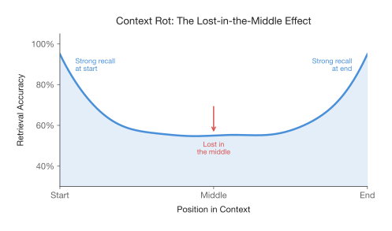
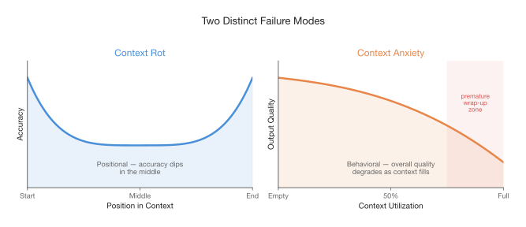
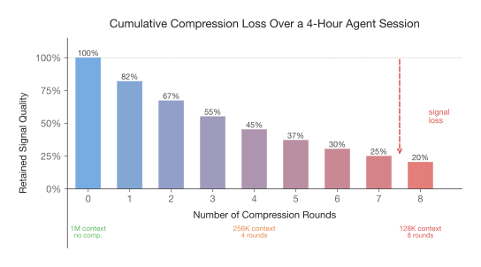
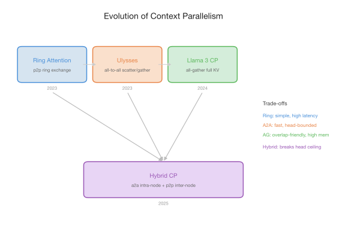
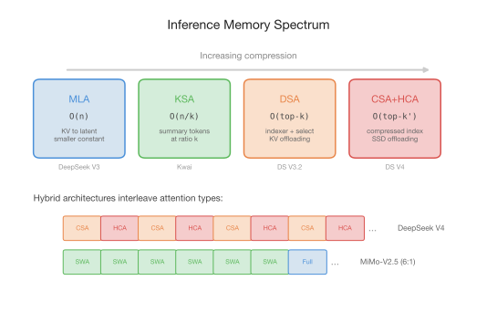
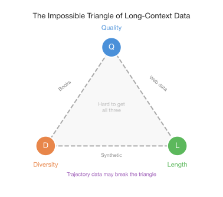

<!-- _class: title -->

# The Ultra-Long Context Paradox

*Why we need 1M+ context — not despite its problems, but because of them*

 

An opinion piece

---

# The Status Quo

- Context length: **4K → 256K** in just two years
- Gemini, Claude, GPT — all frontier models advertise six-figure context lengths
- By many accounts, long context is a **solved problem**

 

## **It isn't.**

- Models degrade on long inputs
- Agents lose their thread halfway through complex tasks
- The promise of *"just paste everything in"* crumbles under scrutiny

---

# The Paradox (Preview)

The field has responded with **context management** — compaction, RAG, sub-agent architectures

A natural question: push to **1M+ tokens**, or stop here and **manage what we have**?

 

> The very problems that make long context unreliable are the same problems that demand we scale it further.

 

The resolution points toward something bigger than either approach alone.

---

<!-- _class: section-title -->

# The Problems Are Real

*Context rot and context anxiety*

---

# Context Rot

**Definition**: Retrieval accuracy degrades when relevant information sits in the **middle** of long context

- Liu et al. [1]: the *lost-in-the-middle* effect
- U-shaped accuracy: strong at beginning/end, weak in middle

**Root cause**: Attention produces n² pairwise relationships → finite *attention budget* depletes

> "a performance gradient rather than a hard cliff" — Anthropic [2]

The key word is **precision** — a retrieval problem tied to *position*

---

# Context Anxiety

**Definition**: *Behavioral* degradation as models sense context limits approaching

- Anthropic [4]: Claude Sonnet 4.5 would *"wrap up tasks prematurely"*
- Levy et al. [5]: reasoning degrades with input length, even when extra tokens are irrelevant
- Not about position, but **load** — instruction-following decay, coherence loss, style drift

 

### Context Rot
- Positional bias
- Middle is worse
- Wrong **answers**

### Context Anxiety
- Behavioral degradation
- Overall quality fades
- Wrong **decisions**

---

# Rot vs. Anxiety: Two Distinct Failures

A model that can't find a fact gives a **wrong answer**.
A model that prematurely abandons a debugging session **gives up on the right answer entirely**.

---

<!-- _class: section-title -->

# Context Management
*The pragmatic answer — and its fatal flaw*

---

# The Toolkit Works... Once

Anthropic: find *"the smallest possible set of high-signal tokens"* [2]

**Mature toolkit**: compaction, sub-agent architectures, RAG, just-in-time retrieval

- A 16K RAG pipeline often **outperforms** 128K raw context on retrieval [7]

 

### But: all context management involves **irreversible decisions**

> "It is difficult to know which tokens the future turns will need." — Anthropic [4]

---

# The Crack in the Argument

**"Recoverable" ≠ "Present"**

- Anthropic: store compacted messages externally, cross-session memory [4]
- Zhang et al.: context as programmable object, recursive examination [31]
- But re-fetching requires the model to **know something is missing**
- The *reasoning trace* — design choices, rejected alternatives — vanishes when compressed

 

**Cumulative loss compounds**:
Compress **1x** → probably fine | Compress **8x** over 4 hours → ghost of a signal

**Can you summarize your way through an 11-hour coding session?**

---

# Cumulative Compression Loss

Each compression bets you know what the future will need.
Over enough bets, some will be wrong — a single wrong bet **cascades into failure**.

---

<!-- _class: section-title -->

# The Turn
*Why ultra-long context is non-negotiable*

---

# The Argument Inverts

The lossy nature of context management → the strongest argument **for** scaling context

| | **128K context** | **1M context** |
|---|---|---|
| 4-hour session | ~8 compression rounds | Possibly **zero** |
| Signal loss | Compounds each round | Minimal |
| Recovery | Must re-fetch (if you know it's missing) | Still present |

 

> **Ultra-long context doesn't eliminate context management.**
> **It reduces the damage management inflicts.**

---

# Evidence: Long-Horizon Agency

**MiMo-V2.5-Pro** [8] — 1M native context, hybrid sparse/global attention:

| Task | Duration | Tool Calls | Result |
|---|---|---|---|
| PKU Compiler (SysY → RISC-V) | 4.3 hours | 672 | **233/233** on hidden tests |
| Desktop Video Editor | 11.5 hours | 1,868 | 8,192 lines of code |

 

**GLM-5.1** [9]:
- Linux desktop in browser: **8 hours, 1,200+ steps**, 4.8MB output
- Vector DB optimization: 3,108 → 21,472 QPS (**6.9x**) across 655 iterations

---

# Context Grokking

A conventional objection: long-context training helps retrieval, but does it help *agency*?

 

**Long-context understanding** ≠ **Long-horizon agency**
(retrieve/synthesize over input) &nbsp;&nbsp;&nbsp; (plan/backtrack/recover over many steps)

 

**Context grokking**: reasoning gains from context scaling stay **flat** through 4K → 256K, then **suddenly manifest past ~512K**

- Gains on LongBench v2 (context) **and** AIME (reasoning)
- As if the capacity to hold state and reason over it were *latent all along*

---

# Harness Awareness

The model must hold evolving state across **thousands of interactions**:
- Code written, tests run, regressions diagnosed, design decisions made

MiMo: diagnosed a regression where *a refactoring pass broke two tests* — recovered because it **still remembered** what it changed and why

> "makes full use of the affordances of its harness environment, manages its memory, and shapes how its own context is populated"

**Ultra-long context + intelligent management — not one substituting for the other**

 

### The floor/ceiling argument:
Ultra-long context = **floor** (minimum capability) | Context management = **ceiling** (efficiency)
You can't manage context you **never had**.

---

<!-- _class: section-title -->

# The Three Pillars
*Scaling without making things worse*

---

# Pillar 1: Training — Context Parallelism

A 1M-token sequence doesn't fit in a single device → **Context Parallelism (CP)**

| Approach | Mechanism | Limitation |
|---|---|---|
| **Ring Attention** [10] | Pass KV blocks around a ring | P2P overhead at large CP |
| **DeepSpeed Ulysses** [11] | All-to-all: seq → head partitioned | CP ≤ #KV heads (GQA ceiling) |
| **Llama 3** [12] | All-gather full KV tensors | Higher memory cost |
| **Hybrid** [13,14] | A2A intra-node + P2P inter-node | Active design space |

---

# Pillar 2: Inference — Memory Spectrum

At 1M tokens, KV cache → hundreds of GB per request

| Level | Method | Complexity | Key Trade-off |
|---|---|---|---|
| **Embedding** | MLA [15] | O(n), smaller constant | Still linear; needs CP for serving [16] |
| **Token** | KSA [17] | O(n/k) | Learnable summary tokens |
| **Selection** | DSA → CSA [20,21] | O(top-k) | Enables KV offloading to host/SSD |
| **Hybrid** | HCA + CSA [21] | Mixed | Interleaved layers; ~10x KV reduction |
| **Mid-training** | LoZA [23]* | Structured sparse | Retrofits onto existing models |

* Full disclosure: my own work. Biased but fills a gap.

---

# Pillar 2: The Inference Spectrum

Hybrid architectures interleaving compression levels are the emerging trend:
- DeepSeek V4: HCA + CSA interleaved
- MiMo-V2.5-Pro: sliding window + global at 6:1
- HySparse [22]: full + sparse layers, ~10x KV-cache reduction

---

# Pillar 3: Data — The Impossible Triangle

**Where do you find 1M-token training sequences?** You mostly don't.

| Source | Typical Length | Challenge |
|---|---|---|
| Books | 50K–100K | Limited diversity |
| Papers | 5K–15K | Too short |
| Code repos | Variable | Sparse long-range dependencies past 512K |

**Evolution**: RoPE extension [24,25] → direct training on long data [26,27]
- ProLong-8B: 512K capability with **5%** of Llama-3.1's long-context tokens

**Three sources**: curated long-form text, synthetic generation [28,29], trajectory data

---

# The Impossible Triangle

**Quality + Diversity + Length** — any two are straightforward; all three at 1M scale is the real data engineering challenge.

---

<!-- _class: section-title -->

# The Deeper Frame
*Memory scaling*

---

# Three Axes of Memory

| | **Parametric** | **Non-Parametric** | **Conditional** |
|---|---|---|---|
| **What** | Weights | Context | Engram [30] |
| **Contains** | What model *knows* | What model *sees* | O(1) lookup store |
| **Scaling** | More params → compute | More tokens → KV cache | Tiered storage |
| **Sparsity** | MoE | Sparse attention | Deterministic addressing |

 

### The unifying insight: **Sparsity**

You don't need to activate everything all the time.
Sparse attention and sparse parameters are **different faces of the same principle**.

AGI requires efficient scaling of **all three** through sparsity and tiered storage.

---

<!-- _class: section-title -->

# The Resolution
*Neither alone, both together*

---

# The Paradox Resolves

### Atomic Ability (Floor)
**Ultra-long context**

- How long a horizon
- How complex a state
- How many interactions

Without it, no management can substitute for information **never there**

### Intelligence Layer (Ceiling)
**Context management**

- What to attend to
- What to compress
- When to retrieve

Without it, even 1M tokens is a haystack with **no strategy**

 

**Working memory capacity** vs. **cognitive strategy** — intelligence emerges from both.

---

# Already Happening

| System | Duration | What It Demonstrates |
|---|---|---|
| MiMo-V2.5-Pro | 11.5 hours | 1M context + *harness awareness* |
| GLM-5.1 | 8 hours | Self-iterating through 1,200+ cycles |

Neither raw context nor management alone would have sufficed.

 

### On cost:
Five years ago, trillion-parameter models seemed prohibitive.
The history of deep learning: costs that seemed **insurmountable** becoming **routine**.

> The question is not *whether* to build longer context or smarter management.
> It's that we cannot build the latter without first solving the former.
> And when we solve both, what emerges may be something **qualitatively new**.

---

<!-- _class: title -->

# Thank You

 

Key takeaways:
1. Context rot and anxiety are real — but not reasons to stop scaling
2. Context management is lossy and compounds — ultra-long context reduces the damage
3. **Context grokking**: reasoning unlocks past ~512K
4. Three pillars: training (CP), inference (sparse/hybrid), data (impossible triangle)
5. Sparsity unifies memory scaling across all axes
6. **Atomic ability + intelligence layer = the path forward**

 

References: see blog post for full citation list [1]–[31]

