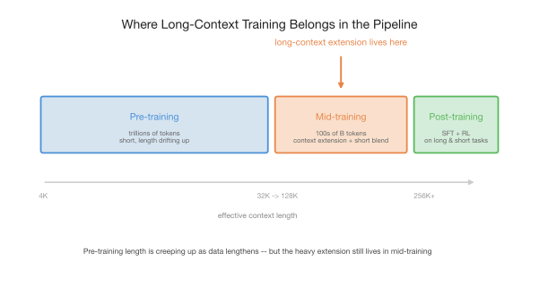
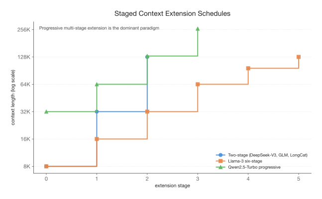
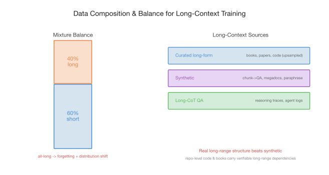
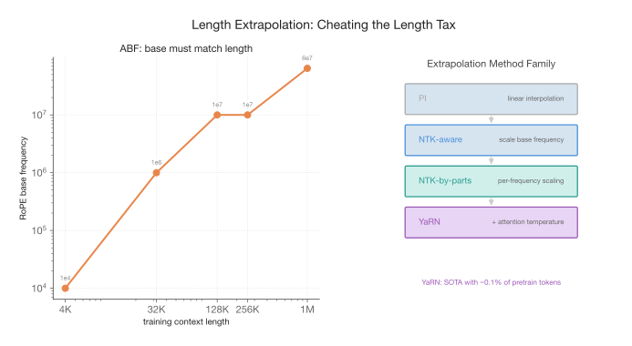
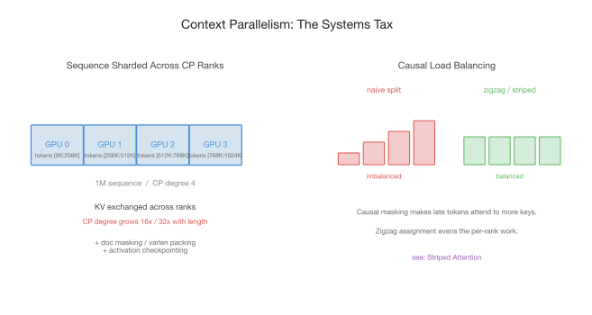
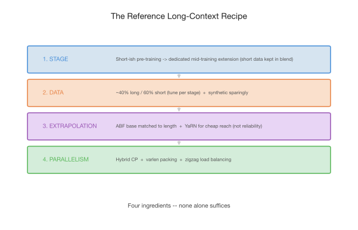

*A practitioner's guide to the four ingredients — stages, data, extrapolation, and parallelism — that turn a short-context base model into a long-context one.*

I've written about long context twice already. [The Ultra-Long Context Paradox](./ultra-long-context-paradox.html) argued the *why* — that we need 1M+ context despite, and because of, its problems. [The Sparse Attention Landscape](./sparse-attention-landscape.html) traced the *what* — the architectures that make long context affordable to serve. Both posts circled a question they never answered head-on: **how do you actually train one of these models?**

That's a different kind of question. Architecture papers tell you what the attention should look like. They rarely tell you what data to feed it, where in the pipeline to extend the window, how to set the RoPE, or how to keep a million-token sequence from blowing up your GPU memory. These are the unglamorous decisions that determine whether your long-context model works — and they're mostly folklore, scattered across a dozen technical reports, each describing what *one* team did without saying why.

This post is my attempt to write the recipe down. There are four ingredients: **stages** (where in the pipeline), **data** (what to feed), **extrapolation** (how to cheat the length tax — the quadratic blow-up in compute and memory that every extra token of context costs you), and **parallelism** (how to afford it). None of them is sufficient alone. Let me take them in order.

## Ingredient 1: Stages — Where Does Long Context Belong?

The first decision is the most consequential and the least discussed: *at what point in training do you extend the context window?*

The traditional answer is "pre-train long from the start," and the traditional wisdom is that this is wasteful, for three reasons. **Cost:** attention is quadratic, and context parallelism (more on that later) eats into your parallelism budget — training at 128K from token zero would multiply your pre-training bill for capability you don't need yet. **Data scarcity:** genuinely long documents are rare; most of the web, and most of the highest-quality text, is short. **Mismatch:** the bulk of what a model needs to learn — grammar, facts, reasoning — is learnable in 4K-8K windows. Spending quadratic compute to learn it in a 128K window is waste.

That wisdom is now softening at the edges. Several recent reports quietly raise the *pre-training* length from the start: MiMo-V2-Flash [21](#ref-21) pre-trains at 32K, and DeepSeek-V4 [22](#ref-22) appears to climb 4K → 16K → 64K *within* pre-training, reserving YaRN only for the final 64K → 1M jump — a departure from earlier DeepSeek models, which leaned on YaRN for every extension. The likely driver is data, not architecture: as the ~30T-token web corpus nears exhaustion, PDF and book data gradually take a larger share of the mix, and that data is simply longer. Where web text might be ~80% under 8K, scanned documents and books skew far more long-form — so a longer pre-training window suffers fewer truncations, and the natural pre-training length drifts upward on its own.

Still, this is a shift in the *baseline*, not a relocation of the work. The heavy lifting of context extension still happens in **mid-training** [1](#ref-1).

  

<em>Figure 1. Bulk pre-training stays short and cheap; context extension happens in mid-training; both mid-training and post-training work to preserve short-context ability. The long-context window is grown where it's relatively cheap to grow.</em>

Mid-training has emerged as a distinct stage between pre-training and post-training — a computational middle ground for objectives like domain expansion, context extension [1](#ref-1), and laying the groundwork for later RL. OLMo 2 [2](#ref-2) helped establish it as a load-bearing part of the modern pipeline. The recipe is almost universal now: pre-train the bulk at short context, then extend the window in mid-training on a curated mixture that keeps enough short data in the blend to hold short-context ability steady.

**The dominant pattern is progressive, multi-stage extension.** You don't jump from 8K to 1M in one step — you climb a ladder.

  

<em>Figure 2. Three real schedules. A coarse base→32K→128K climb is the common baseline; Llama-3 uses a granular six-stage climb; Qwen2.5-Turbo pushes progressively to 256K. All share the same shape: roughly multiply the window, stabilize, repeat — adding rungs as 1M targets become standard.</em>

Multi-stage extension (base → 32K → 128K, and increasingly on to 256K–1M) is the norm — DeepSeek-V3, GLM-4.5, and our own LongCat-Flash all climb this way [3](#ref-3). As 1M-token windows become table stakes, the ladder simply grows more rungs. Llama-3 [4](#ref-4) takes the most granular path: six stages from 8K to 128K, spending roughly 800B tokens on extension alone. Qwen2.5-Turbo [5](#ref-5) climbs progressively through 32K → 64K → 128K → 256K, and smaller open models like xGen-small [13](#ref-13) follow the same staged annealing-then-extension shape.

How many tokens does extension actually cost? Less than you'd fear. Fu et al. [6](#ref-6) showed 500M–5B well-curated tokens suffice for 128K. ProLong [7](#ref-7) reached 512K capability using only ~5% of Llama-3.1's long-context budget. Llama-3's 800B is the high end; Phi-4 [8](#ref-8) used ~250B. The lesson: **context extension is cheap relative to pre-training, as long as you do it as a dedicated stage rather than smearing it across the whole run.** That said, the budget is creeping up: as more downstream trajectories — agent traces, long tool-use sessions — flow into mid-training, the data volume at this stage is growing with them.

> **Opinionated default.** Keep bulk pre-training short — but don't be dogmatic; let the natural length of your data set the floor → extend in a dedicated mid-training stage along a progressive ladder (multiply the window each step, by 2-4×, not necessarily exactly double) → keep short data in the blend throughout so short-context ability never slips. Don't try to reach your final window in one giant leap.

## Ingredient 2: Data — Composition and Balance

Once you know *when* to extend, the question becomes *what to feed*. This is where most of the real engineering lives, and where the most expensive mistakes happen.

The single most important number in long-context data is the **long/short ratio**. The intuition that trips people up: you cannot train on all-long data. Do that, and the model catastrophically forgets short-context ability and suffers distribution shift — the long corpus is narrower and weirder than the pre-training mix. Qwen2.5 [5](#ref-5) settled on **40% long sequences at the current target length, 60% shorter sequences**. The 60% short isn't filler; it's what keeps the model from regressing on everything it already knew. Treat 40/60 as a starting point, not gospel — the right ratio almost certainly differs across models, and across the stages of a single extension ladder; it's a knob to tune, not a constant to copy.

  

<em>Figure 3. The 40/60 long/short balance keeps short-context ability intact while teaching long-range dependency. Long data comes from three sources, and synthetic must be used sparingly.</em>

Where does the long data come from? Three sources, in rough order of trustworthiness:

- **Curated long-form text** — books, papers, legal filings, and code with genuine cross-file dependencies. Repository-level code is especially valuable: its import graphs and cross-file references encode real, verifiable long-range structure that synthetic data struggles to imitate. In practice the rarest of these are *upsampled* (repeated) to fill the length budget — cheap, but over-repetition risks memorization.
- **Synthetic data** — chunk-and-QA (split a document, generate QA pairs, append them [9](#ref-9), a recipe production models like NVIDIA's Nemotron Nano 2 [12](#ref-12) adopt directly), megadocs that stitch related sources into long sequences with controlled dependencies [10](#ref-10), and paraphrasing that teaches retrieval through rephrasing [11](#ref-11).
- **Long-CoT QA and trajectories** — reasoning traces, multi-turn tool-use sessions, long-horizon agent logs. Increasingly important as models move toward agentic work.

A sharp caution on synthetic: relying *solely* on synthetic data exacerbates hallucination and degrades knowledge-intensive performance [1](#ref-1). Synthetic data teaches the *shape* of long-range retrieval, but it can't substitute for the factual density of real text. Use it to fill the length distribution, not to replace the corpus.

This connects back to a tension I raised in the [Ultra-Long Context Paradox](./ultra-long-context-paradox.html): the **impossible triangle** of quality, diversity, and length. Any two are easy; all three at once, at 1M scale, is the unsolved data-engineering problem behind every long-context model. The long/short ratio and the three sources are both tactics for buying back what the triangle takes away.

> **Opinionated default.** Start near 40% long / 60% short and tune per model and per stage — it's not a universal constant. Lead with curated real long-form; use synthetic to fill the length tail, never as the backbone.

## Ingredient 3: Extrapolation — Cheating the Length Tax

Here's the dream: train short, test long. If you could train at 32K and have the model *just work* at 128K, you'd dodge most of the cost. You can't get all the way there — but you can get surprisingly far, and the lever is almost embarrassingly simple.

That lever is the **RoPE base frequency**. Rotary position embeddings encode position by rotating query and key vectors at frequencies set by a base parameter (classically 10,000). The problem is that RoPE doesn't generalize past its trained length — rotations at positions it never saw look like noise. The fix, **Adjusted Base Frequency (ABF)** [14](#ref-14), is just: raise the base. Bigger base → slower rotation → longer effective period → more reach.

  

<em>Figure 4. Left: the RoPE base must scale with training length — 10K at 4K, 1M at 32K, 10M+ past 256K. Right: the method family, from naive linear interpolation (PI) up to YaRN, which adds attention-temperature scaling and reaches SOTA with ~0.1% of pre-training tokens.</em>

The critical, under-appreciated point is on the left of Figure 4: **the base must match the training length.** This isn't a free knob you crank to infinity. Qwen2.5 raises the base from 10,000 to 1,000,000 when extending to 32K, and to 10,000,000 past 256K [5](#ref-5). ProLong [7](#ref-7) found that keeping Llama-3's stock 500,000 base at 512K training length *degrades* performance — Dynamic NTK suggested ~64,000,000 instead. Too small a base for your length, and long-range positions collapse together; the base and the length are coupled.

There's a family of methods refining the raw base bump:

- **Position Interpolation (PI)** [15](#ref-15) — linearly squeeze positions into the trained range. Simple, but uniform scaling crushes high-frequency (local) detail.
- **NTK-aware** [16](#ref-16) — scale the base nonlinearly, by a factor of td/(d-2) for length ratio t and head dim d. Preserves high frequencies better than PI.
- **NTK-by-parts** — scale different frequency bands differently; leave high-frequency (local) slots alone, stretch only the low-frequency (long-range) ones. The reason: high-frequency dimensions already complete many rotations within the trained window, so the model has seen their full range and they extrapolate fine — it's the slow, low-frequency dimensions that never finish a cycle and need interpolating.
- **YaRN** [17](#ref-17) — NTK-by-parts plus an attention-temperature correction (the softmax logits contract as context grows; temperature counters it). YaRN reaches SOTA context extension fine-tuning on **~0.1% of the original pre-training tokens**, in a few hundred steps.

The counterintuitive result that ties it together: a *short* fine-tune with an adjusted base can extrapolate far beyond its training length. Code Llama [18](#ref-18) set the base to 1,000,000, trained at 16K, and reached 100K+. The base-scaling literature [16](#ref-16) shows fine-tuning at 4K-16K with the right base can extrapolate to 100K.

But — and this is the part I want to push on — **extrapolation buys reach, not reliability.** A model that *extrapolates* to 128K will answer questions there, but its precision in the middle of that window (the context rot I described in the [Paradox post](./ultra-long-context-paradox.html)) is worse than a model that genuinely *trained* at 128K. Extrapolation is a discount, not a free lunch. Use it to stretch past your training length cheaply, but if 128K is your product spec, do at least some real training at 128K.

> **Opinionated default.** Use ABF, with the base matched to each stage's length (not a fixed value). Reach for YaRN when you need cheap extension on a small token budget. You *can* ship a window you only ever extrapolated to — it just tends to be measurably weaker than one you trained at the target — so if a length matters for your product, spend at least some real training there.

## Ingredient 4: Parallelism — The Systems Tax

The first three ingredients are about modeling. This one is about whether you can afford to run the recipe at all. A 1M-token sequence does not fit on one device — the activations alone overflow HBM — so you must shard the sequence itself across GPUs. That's **context parallelism (CP)**.

I covered the *evolution* of CP in the [Ultra-Long Context Paradox](./ultra-long-context-paradox.html) — Ring Attention → DeepSpeed Ulysses → Llama-3's all-gather → today's hybrid intra/inter-node schemes. I won't re-run that history here. Instead, the recipe-level things you actually need to get right:

  

<em>Figure 5. Left: the sequence is sharded across CP ranks, which exchange KV; CP degree climbs with length. Right: causal masking makes a naive split badly imbalanced — late tokens attend to far more keys — and zigzag/striped assignment evens the per-rank work.</em>

**Know when you need it.** CP degree grows with context — 16×, 32×, and beyond — and it competes with your other parallelism dimensions for the device budget. You don't pay this tax at 8K; you pay it sharply once you're extending to 128K+. Budget for it when you plan the extension stages, not after.

**Pack and mask correctly.** Long-context batches are full of variable-length documents. Naive padding wastes enormous compute at these lengths, so you pack documents and use variable-length (varlen) attention with proper document masking — so tokens don't attend across document boundaries. Combined with activation checkpointing, this is what keeps memory tractable.

**Balance the causal load.** This is the subtle one. Causal masking means token *i* attends to all tokens ≤ *i* — so if you split the sequence into contiguous chunks across ranks, the rank holding the *last* chunk does far more attention work than the rank holding the first. A naive split is badly imbalanced (Figure 5, right). The fix is to assign tokens to ranks in a **zigzag / striped** pattern so every rank gets a mix of early and late positions, evening the work — the trick introduced by Striped Attention [23](#ref-23). (A naming caveat to avoid confusion: our own [LongCat ZigZag Attention](https://arxiv.org/abs/2512.23966) [19](#ref-19) borrows the word "zigzag" for a *different* idea — a structured sparse attention pattern retrofitted during continued pre-training — not this CP load-balancing scheme. Full disclosure: that's my work.) The broader point stands regardless of method: **at long context, load balancing across CP ranks is not an optimization, it's the difference between training in days and training in weeks.** Efficient ultra-long training frameworks — e.g. the 128K-to-4M recipe of Xu et al. [20](#ref-20) — are largely engineering victories of exactly this kind.

> **Opinionated default.** Hybrid CP (all-to-all within node, point-to-point across nodes) for dense attention — though with sparse attention's smaller KV footprint, a simpler all-gather scheme becomes acceptable again. Add varlen packing with document masking, activation checkpointing, and zigzag load balancing for the causal mask. Plan the CP degree into your extension stages from the start.

## The Reference Recipe

Putting the four ingredients together, here's the end-to-end default I'd reach for — the thing I'd actually do, absent a specific reason to deviate.

  

<em>Figure 6. The four ingredients as one recipe. Each addresses a different failure mode; skip any one and the model is slow, forgetful, short-sighted, or untrainable.</em>

| Ingredient | Default | Failure it prevents |
|---|---|---|
| **Stage** | Short-ish pre-training (let data set the floor) → dedicated mid-training extension on a progressive ladder, short data kept in the blend | Wasted quadratic compute; short-context regression |
| **Data** | ~40% long / 60% short, tuned per model and stage; real long-form first, synthetic to fill the tail | Forgetting, distribution shift, weak long-range signal |
| **Extrapolation** | ABF with base matched to length; YaRN for cheap reach; real training at the target for reliability | Position collapse; reach without precision |
| **Parallelism** | Hybrid CP, varlen packing + doc masking, activation checkpointing, zigzag load balancing | Out-of-memory; weeks-long training from CP imbalance |

The reason none of these is optional: each guards a different failure mode. Skip staging and you burn compute. Skip data balance and you forget. Skip extrapolation discipline and your window is hollow. Skip parallelism engineering and you simply can't run the job. They interact, too — your extrapolation base depends on your staged lengths; your CP budget depends on those same lengths; your data ratio shifts as the window grows.

## What's Actually Hard

If there's a single thread through all four ingredients, it's that **the bottleneck has migrated from architecture to data and systems engineering.** The attention mechanism is, increasingly, a solved-enough problem — the sparse architectures from [the Landscape post](./sparse-attention-landscape.html) are mature and converging. What separates a long-context model that *works* from one that merely *runs* is the unglamorous stuff: the long/short ratio, the base-frequency schedule, the document masking, the load balancing. The folklore.

I find that genuinely encouraging. Architecture breakthroughs are rare and hard to reproduce. Data and systems engineering is *learnable* — it rewards care, measurement, and the kind of accumulated craft that this post is trying, in a small way, to write down. The recipe isn't secret. It's just scattered. And now, at least the outline of it is in one place.

## References

**[1]** Chengying Tu et al. *A Survey on LLM Mid-Training.* [arXiv:2510.23081](https://arxiv.org/abs/2510.23081), 2025.

**[2]** Team OLMo. *2 OLMo 2 Furious.* [arXiv:2501.00656](https://arxiv.org/abs/2501.00656), 2025.

**[3]** DeepSeek-AI. *DeepSeek-V3 Technical Report.* [arXiv:2412.19437](https://arxiv.org/abs/2412.19437), 2024.

**[4]** Aaron Grattafiori et al. *The Llama 3 Herd of Models.* [arXiv:2407.21783](https://arxiv.org/abs/2407.21783), 2024.

**[5]** Qwen Team. *Qwen2.5 Technical Report.* [arXiv:2412.15115](https://arxiv.org/abs/2412.15115), 2024.

**[6]** Yao Fu et al. *Data Engineering for Scaling Language Models to 128K Context.* [arXiv:2402.10171](https://arxiv.org/abs/2402.10171), 2024.

**[7]** Tianyu Gao et al. *How to Train Long-Context Language Models (Effectively).* [arXiv:2410.02660](https://arxiv.org/abs/2410.02660), ACL 2025.

**[8]** Marah Abdin et al. *Phi-4 Technical Report.* [arXiv:2412.08905](https://arxiv.org/abs/2412.08905), 2024.

**[9]** Linda He, Jue Wang, Maurice Weber, Shang Zhu, Ben Athiwaratkun, and Ce Zhang. *Scaling Instruction-Tuned LLMs to Million-Token Contexts via Hierarchical Synthetic Data Generation.* [arXiv:2504.12637](https://arxiv.org/abs/2504.12637), ICLR 2025.

**[10]** Konwoo Kim et al. *Data-Efficient Pre-Training by Scaling Synthetic Megadocs.* [arXiv:2603.18534](https://arxiv.org/abs/2603.18534), 2026.

**[11]** Yijiong Yu et al. *Training With Paraphrasing the Original Text Teaches LLM to Better Retrieve in Long-Context Tasks.* [arXiv:2312.11193](https://arxiv.org/abs/2312.11193), 2023.

**[12]** NVIDIA. *Nemotron Nano 2: An Accurate and Efficient Hybrid Mamba-Transformer Reasoning Model.* [arXiv:2508.14444](https://arxiv.org/abs/2508.14444), 2025.

**[13]** Erik Nijkamp, Bo Pang, Egor Pakhomov, Akash Gokul, Jin Qu, Silvio Savarese, Yingbo Zhou, and Caiming Xiong. *xGen-small Technical Report.* [arXiv:2505.06496](https://arxiv.org/abs/2505.06496), 2025.

**[14]** Wenhan Xiong et al. *Effective Long-Context Scaling of Foundation Models.* [arXiv:2309.16039](https://arxiv.org/abs/2309.16039), NAACL 2024.

**[15]** Shouyuan Chen et al. *Extending Context Window of Large Language Models via Positional Interpolation.* [arXiv:2306.15595](https://arxiv.org/abs/2306.15595), 2023.

**[16]** Xiaoran Liu et al. *Scaling Laws of RoPE-based Extrapolation.* [arXiv:2310.05209](https://arxiv.org/abs/2310.05209), ICLR 2024.

**[17]** Bowen Peng et al. *YaRN: Efficient Context Window Extension of Large Language Models.* [arXiv:2309.00071](https://arxiv.org/abs/2309.00071), 2023.

**[18]** Baptiste Rozière et al. *Code Llama: Open Foundation Models for Code.* [arXiv:2308.12950](https://arxiv.org/abs/2308.12950), 2023.

**[19]** **Chen Zhang** et al. *Efficient Context Scaling with LongCat ZigZag Attention.* [arXiv:2512.23966](https://arxiv.org/abs/2512.23966), 2025.

**[20]** Chejian Xu et al. *From 128K to 4M: Efficient Training of Ultra-Long Context Large Language Models.* [arXiv:2504.06214](https://arxiv.org/abs/2504.06214), 2025.

**[21]** LLM-Core Xiaomi. *MiMo-V2-Flash Technical Report.* [arXiv:2601.02780](https://arxiv.org/abs/2601.02780), 2026.

**[22]** DeepSeek-AI. *DeepSeek-V4 Technical Report.* [HuggingFace](https://huggingface.co/deepseek-ai/DeepSeek-V4-Pro/blob/main/DeepSeek_V4.pdf), 2026.

**[23]** William Brandon, Aniruddha Nrusimha, Kevin Qian, Zachary Ankner, Tian Jin, Zhiye Song, and Jonathan Ragan-Kelley. *Striped Attention: Faster Ring Attention for Causal Transformers.* [arXiv:2311.09431](https://arxiv.org/abs/2311.09431), 2023.

