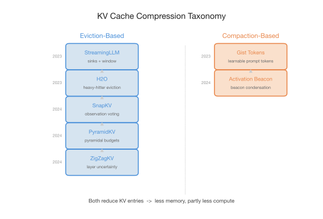
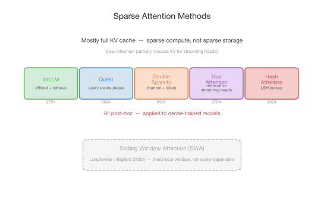
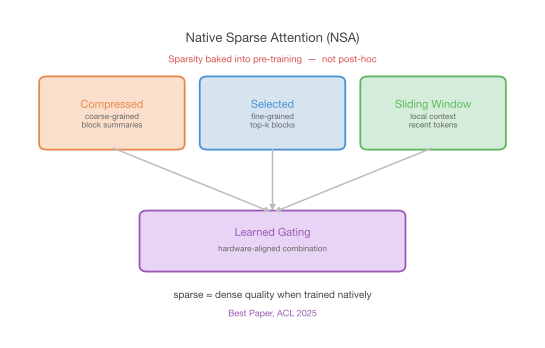
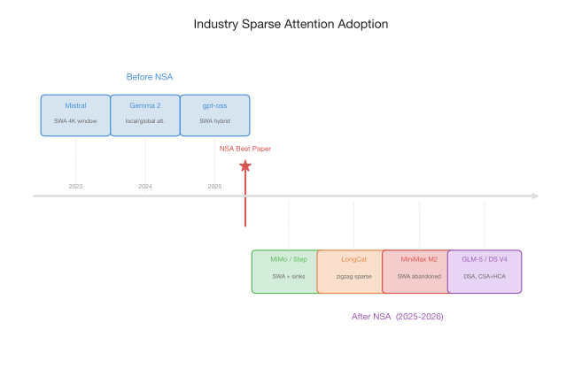
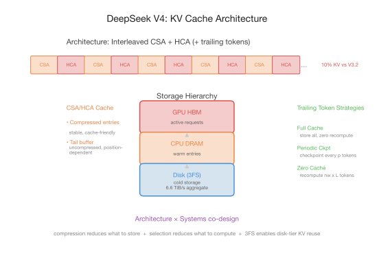
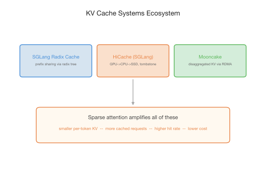

*A timeline of how sparse attention evolved — from KV cache compression to sparse compute to native architectural sparsity — and why the field is circling back to where it started.*

When DeepSeek's Native Sparse Attention (NSA) [1](#ref-1) won best paper at [ACL 2025](https://2025.aclweb.org/program/awards/) — the same ceremony where our own work on the capacity gap in model distillation [31](#ref-31) received the outstanding paper award — it felt like a watershed. Sparse attention — long a research curiosity — had arrived as a first-class architectural primitive. But the ideas behind NSA didn't appear overnight. Two parallel research directions had been building for years, attacking the same bottleneck: the cost of full attention over long sequences.

**KV cache compression** asks *what to store* — and by keeping fewer entries, partly also reduces what needs to be computed. **Sparse attention** asks *what to compute* — attending to only selected tokens while (typically) keeping the full cache intact, since the selection step itself requires scanning or indexing all entries to decide which to attend to. The two directions are separate but deeply related, and this blog traces how they evolved, converged, and eventually came full circle.

## KV Cache Compression

The first direction focused on a practical bottleneck: KV cache memory grows linearly with sequence length, and at long contexts, it dominates GPU memory. The solution: keep fewer entries.

### Eviction-Based Methods

**StreamingLLM** [2](#ref-2) made a foundational observation: the first few tokens in any sequence act as "attention sinks," receiving disproportionately high attention regardless of their content. Retaining these sink tokens plus a sliding window of recent tokens enables stable streaming inference over arbitrarily long sequences without fine-tuning.

**H2O** [3](#ref-3) generalized this with a dynamic eviction policy that operates. A small fraction of tokens ("heavy hitters") account for most of the attention mass. By tracking accumulated attention scores and keeping only heavy-hitter and recent tokens, H2O achieves 5–10x cache reduction with minimal quality loss.

**SnapKV** [4](#ref-4) took a different angle: attention patterns during prefill already reveal which KV entries will matter during generation. By using the last few "observation" tokens to vote on important entries, SnapKV compresses the cache before generation begins (i.e., prefill-only eviction), avoiding runtime eviction.

**PyramidKV** [5](#ref-5) introduced layer-awareness: attention patterns form a pyramid across layers — lower layers attend broadly, upper layers concentrate on fewer tokens. Allocating more cache budget to lower layers yields better compression–quality trade-offs than uniform allocation.

**ZigZagKV** [6](#ref-6) — yes, we had a hand in this one — pushed it further by showing that the cross-layer pattern is not a smooth pyramid but a zigzag — attention concentration alternates non-monotonically. Adaptive per-layer budget allocation based on layer uncertainty outperforms fixed pyramidal schemes.

### Compaction-based Methods

Beyond eviction, another line explored compaction-based compression — reducing the number of KV entries not by dropping them, but by distilling them into fewer, denser representations. **Gist Tokens** [7](#ref-7) trained models to compress prompts into a small set of special tokens via a modified attention mask — up to 26x compression. **Activation Beacon** [8](#ref-8) inserted beacon tokens at regular intervals that learn to condense surrounding activations into compact representations during prefill, extending effective context from 4K to 400K+ via continued pre-training.

  

<em>Figure 1. KV cache compression methods fall into two categories: eviction-based methods (StreamingLLM → H2O → SnapKV → PyramidKV → ZigZagKV) that selectively drop entries, and compaction-based methods (Gist Tokens, Activation Beacon) that distill entries into denser representations.</em>

These methods were effective and widely adopted. But they all operate on the assumption that the KV cache is a bottleneck to be *reduced*. A parallel direction questioned whether the problem was memory at all — or compute.

## Sparse Attention

The second direction largely kept the full KV cache intact but asked: do we need to *compute attention* over all of it?

**InfLLM** [9](#ref-9) offloaded distant KV blocks to CPU/disk and used a relevance-based retrieval mechanism to selectively load the most relevant blocks back to GPU, processing 1M+ tokens on limited GPU memory.

**Quest** [10](#ref-10) made selection query-aware: using page-level key statistics (min/max values) as cheap proxies, it dynamically selects different KV subsets for different query tokens — avoiding the static eviction policies of earlier methods.

**Double Sparsity** [11](#ref-11) exploited sparsity along two dimensions simultaneously — channel-level sparsity to quickly identify important tokens, then token-level sparsity to attend only to those. The compounded effect yields speedups from both axes.

**Duo Attention** [12](#ref-12) observed that attention heads naturally divide into "retrieval heads" (need full-context access) and "streaming heads" (only attend locally). Profiling heads and applying full cache only to retrieval heads achieves ~2.5x memory reduction while preserving long-context capability.

**HashAttention** [13](#ref-13) used locality-sensitive hashing to convert the O(n) attention lookup into approximate O(1) retrieval, attending only to hash-matched key-value pairs.

  

<em>Figure 2. Sparse attention methods keep the full KV cache but compute attention over selected subsets. Selection strategies range from offloading with retrieval (InfLLM) to query-aware page selection (Quest) to head-level splitting (Duo Attention) to hash-based lookup (HashAttention).</em>

These methods addressed compute rather than memory. And they mostly were *post-hoc* — applied to models trained with full attention, hoping the sparse approximation wouldn't degrade quality too much. An earlier, simpler form of "attend to less" already existed: **sliding window attention (SWA)**, rooted in Longformer [14](#ref-14) and BigBird [15](#ref-15). SWA is a fixed structural pattern — attend only to a local window — rather than query-dependent selection. The industry would adopt it as a pragmatic alternative long before the more sophisticated methods matured.

## Industry Before the Spark

Even before NSA, the industry had adopted SWA — always hybrid with full attention at a fixed ratio (typically 1:5 to 1:7), trading global receptive field for linear memory growth.

**Mistral** [16](#ref-16) pioneered this in open models with a 4096-token sliding window. **Gemma 2** [17](#ref-17) refined it with alternating local/global layers. **gpt-oss** [18](#ref-18) and several other open models followed suit.

SWA was not marketed as "sparse attention" at the time — it was simply a practical architectural choice. But in hindsight, it represented the industry's first large-scale bet that not every layer needs to attend to everything.

## The Spark: Native Sparse Attention

DeepSeek's **Native Sparse Attention** [1](#ref-1) resolved a fundamental tension. Instead of approximating dense attention after the fact, NSA decomposes attention into three native branches:

1. **Compressed attention** — coarse-grained attention over token block summaries
2. **Selected attention** — fine-grained attention over top-k important blocks identified by the coarse branch
3. **Sliding window** — local context for recent tokens

All three branches are combined via learned gating, and the design is hardware-aligned — block-level operations, contiguous memory access — for actual wall-clock speedups, not just theoretical FLOP reductions.

The key finding: sparse attention matches dense attention quality *when trained natively*. The quality gap that plagued post-hoc methods largely disappears when the model learns to route information through sparse pathways from the start. This result, validated at scale, is why NSA won best paper at ACL 2025.

  

<em>Figure 3. NSA decomposes attention into three hardware-aligned branches — compressed, selected, and sliding window — combined via learned gating. The design is natively integrated into pre-training, not applied post-hoc.</em>

## Industry After the Spark

NSA opened the floodgates. Within months, major industry labs shipped sparse attention architectures:

**Xiaomi MiMo** [19](#ref-19) and **Step** [20](#ref-20) adopted SWA hybrid architectures with attention sinks. This simple combination proved robust across a range of context lengths.

**LongCat ZigZag Attention** [21](#ref-21) — another one from our shop — took a different approach — retrofitting structured sparse patterns onto existing full-attention models during continued pre-training, making 1M-token processing practical without re-training from scratch.

**MiniMax M2** [22](#ref-22) reported an important negative result: pure sliding window attention *failed* for their use case — a cautionary counterpoint to the SWA enthusiasm, highlighting that naive SWA without careful design (attention sinks, global layers, or appropriate hybrid ratios) is insufficient.

DeepSeek themselves continued evolving the line: NSA became **DeepSeek Sparse Attention (DSA)** in V3.2 [24](#ref-24), then **Compressed Sparse Attention (CSA)** in V4 [25](#ref-25), interleaved with a new **Heavily Compressed Attention (HCA)** layer. The V4 architecture represents the current state of the art.

**GLM-5** [23](#ref-23) followed the DSA design philosophy, validating that the architectural pattern transfers across model families.

  

<em>Figure 4. Timeline of industry sparse attention adoption. Before NSA: SWA hybrid (Mistral, Gemma 2, gpt-oss). After NSA: SWA+sinks (MiMo, Step), structured sparse (LongCat), DSA-style (GLM-5), and the DeepSeek evolution from NSA → DSA → CSA+HCA.</em>

The trend: industry is converging on **hybrid sparse patterns** — not pure SWA, not pure dense, but architecturally designed mixtures of local, global, compressed, and selected attention.

## The Reversal: Back to KV Cache Compression

Here is where the story takes a surprising turn.

### The Memory Wall

At 1M context length, KV cache memory can exceed the model parameters themselves. Even sparse attention doesn't help that much at the memory level — DSA-style methods must still hold *all* KV entries to perform the selection/indexing step before sparse computation, and SWA, without dedicated cache system support, naively requires the full KV cache to maintain correct prefix matching (as detailed in the next section). The full cache must exist even though only a subset is ultimately used.

Under prefix/radix caching systems, the memory pressure intensifies further: the cache must store KV for many concurrent requests to enable reuse. With full attention at 1M tokens, per-request KV is massive, total cache capacity fills fast, cache hit rates stay low, and most requests still require full prefill. The memory wall is both per-request *and* system-wide.

### Sparse Attention's Uneasy Relationship with KV Reuse

All sparse attention schemes create tension with prefix/radix caching. The core assumption of radix cache is straightforward: *same token sequence → same KV*. Sparse attention breaks this at different levels:

**SWA** faces the starkest version. Two options, same tension: either save all KV (correct prefix matching but wastes storage, negating SWA's savings) or only save the last nwin tokens per SWA layer (efficient but breaks prefix matching — the tree matches tokens, but the KV data simply doesn't exist). Early frameworks chose the first option, storing full KV "to be compatible" — effectively nullifying SWA's advantages entirely.

**DSA-style selection** faces yet another version: the full cache must exist for the indexer to select over, so cache storage scales with full context length regardless of how sparse the final computation is.

**CSA/HCA** faces a different version. Compressed entries are stable and cache-friendly, but a tail buffer of uncompressed tokens must be maintained until enough accumulate for the next compression block. These tail states are position-dependent and cannot be naively shared across requests with different continuations. The heterogeneous cache — compressed entries, tail states, and SWA windows — violates the uniform-block assumption behind Paged Attention and its variants.

SWA and CSA/HCA are the most illustrative cases. The MiMo engineering blog [26](#ref-26) details how resolving the SWA tension required fundamental rearchitecting, and DeepSeek V4 [25](#ref-25) shows how CSA/HCA demanded a wholly new cache layout. The practice from MiMo as an example:

- **Dual KV pools**: separate Full Attention pool (O(N)) and SWA pool (O(W)), with a unified logical view to the scheduler. SWA storage strictly bounded.
- **SWA-aware prefix tree**: matching rules upgrade from "token equal" to "window safety length" for SWA. Tokens beyond these boundaries are treated as miss.
- **Layerwise async prefetch**: SWA layers need so little KV that host→device prefetch overlaps with compute perfectly — effectively zero-cost cache reads.

### DeepSeek V4: Architecture Meets Systems

If MiMo's engineering shows how to make SWA work with cache systems, DeepSeek V4 [25](#ref-25) shows what happens when you co-design the architecture and the cache from the ground up. V4 represents the fullest convergence of KV cache compression with sparse compute.

**Architecture.** CSA compresses KV at ratio m=4, then performs DSA-style sparse selection over the compressed entries. HCA compresses more aggressively at ratio m'=128, but keeps dense attention over the compressed result. CSA and HCA are interleaved across layers, with pure SWA for the first two layers. The result: DeepSeek-V4-Pro needs only **10% of the KV cache** compared with V3.2 at 1M context.

A key design insight: CSA/HCA compressed entries are smaller and more stable than raw KV — they have no sliding window lifecycle, making them naturally more amenable to prefix/radix caching. This is partly by design: the compression addresses the KV reuse dilemma head-on, though uncompressed tail states still require special handling.

**Systems.** V4's on-disk KV cache storage is built on **3FS** [27](#ref-27) (Fire-Flyer File System), DeepSeek's open-source distributed file system over SSDs and RDMA. 3FS achieves 6.6 TiB/s aggregate read throughput across 180 storage nodes and 40 GiB/s per-client KV cache throughput.

For CSA and HCA, compressed KV entries are stored across a tiered hierarchy — GPU HBM for active requests, host DRAM for warm entries, and disk (via 3FS) for cold storage. On a prefix hit, compressed entries are read and reused up to the last complete compression block. For SWA, V4 offers three strategies with explicit storage/compute trade-offs:

1. **Full SWA Caching** — store all SWA KV. Zero recompute, but write-intensive (only the last nwin tokens are ever read per hit).
2. **Periodic Checkpointing** — checkpoint SWA KV every p tokens. Tune p for the desired balance.
3. **Zero SWA Caching** — store nothing. Recompute nwin × L tokens using cached CSA/HCA entries. Minimal storage, maximal compute.

The trade-off is deployment-specific and explicitly parameterized — a far cry from the one-size-fits-all eviction policies of the first wave.

  

<em>Figure 5. DeepSeek V4's KV cache architecture. CSA/HCA compressed entries are stored across GPU→CPU→disk (3FS), while SWA entries offer three caching strategies with explicit storage/compute trade-offs. The heterogeneous cache layout reflects the convergence of architectural compression with systems-level storage.</em>

### The Systems That Make It Work

Beyond DeepSeek, a broader systems ecosystem has emerged. These systems were not designed for sparse attention specifically — they target KV cache management in general — but sparse attention amplifies their value by changing the cache's size, structure, and access patterns.

**SGLang's radix cache** [28](#ref-28) enables prefix sharing across requests via a radix tree: when multiple requests share a system prompt, their KV entries are computed once and reused via longest-prefix matching. Originally designed for full attention, it becomes even more impactful with sparse attention — whether SWA or CSA/HCA, the smaller per-token cache means the same radix tree capacity covers far more requests.

**HiCache** [29](#ref-29) (SGLang) extends radix caching with hierarchical storage: GPU HBM → CPU DRAM → SSD. It uses a **tombstone** design for cache invalidation — marking expired entries without immediately reclaiming them, enabling correct prefix matching across tiers. While designed for general KV cache management, HiCache becomes particularly valuable for hybrid attention architectures: the different cache lifecycles of full-attention, SWA, and compressed entries each require tier-aware handling that a flat cache cannot provide.

**Mooncake** [30](#ref-30) disaggregates KV cache from compute entirely: caches stored in distributed memory pools accessible via RDMA. Prefill and decode can run on different machines while sharing the cache, and cross-request KV reuse eliminates redundant computation. Like radix caching, Mooncake is architecture-agnostic — but sparse attention's reduced cache footprint makes disaggregation more practical by lowering the transfer volume per request.

### The Payoff

The logic above leads to a clean conclusion. Any sparse attention scheme that reduces per-token KV storage — whether SWA, CSA/HCA, or a hybrid — means the same storage budget can hold more requests' caches simultaneously. More cached requests means less eviction pressure and less recomputation when a returning request finds its cache still alive. The cache's time-to-live (TTL) — how long a request's KV entries survive before being evicted to make room — extends accordingly. Longer TTL *increases* effective cache hit rate, even though sparse-aware prefix matching introduces stricter hit conditions.

The effect is most pronounced for SWA and CSA, which achieve the largest storage reductions. MiMo's Hybrid SWA cuts per-token KV to roughly 1/7, and production data confirms the result: **93% average KV cache hit rate** under mainstream harness frameworks, **95%+** for power users in long-session agent scenarios [26](#ref-26). Smaller per-token storage admits higher hit rate, which in turn slashes real-world prefill and recomputation cost — exactly the outcome the first wave of KV cache compression was chasing, now achieved at system scale.

  

<em>Figure 6. The systems ecosystem for KV cache management. Radix cache enables prefix sharing, HiCache adds hierarchical tiering with tombstone-based invalidation, Mooncake disaggregates cache from compute, and GCache provides distributed RDMA storage. Sparse attention amplifies the value of each by shrinking per-token cache footprint.</em>

### The Circle Closes

The field started with KV cache compression as an academic optimization — StreamingLLM, H2O, SnapKV. Moved to sparse attention for more principled compute savings — Quest, Duo Attention, HashAttention. Then, as context scaled to 1M and beyond, returned to KV cache compression — but at a fundamentally higher altitude: native architectural compression (CSA + HCA), hierarchical storage (HiCache, 3FS), distributed infrastructure (Mooncake, GCache), and sparse-aware prefix caching. A full loop.

## What Comes Next

If I were to speculate — and this is where the review becomes opinion — the next phase will be defined by the convergence of three forces.

**Architectural sparsity will become table stakes.** Every new frontier model will ship with some form of native sparse attention — as if on cue, MiniMax M3 [32](#ref-32) launched its own MiniMax Sparse Attention while this post was being written, though notably without a compression component. The question will shift from "whether" to "what mixture" — the optimal interleaving of compressed, selected, sliding-window, and full attention for different model sizes and context lengths.

**Systems-level KV management will become as important as the attention mechanism itself.** Radix caching, hierarchical storage, and distributed KV pools will determine the practical context length a system can serve — independent of the model's theoretical capability.

**Compression and selection will merge into a single design space.** The two directions — "what to store" and "what to compute" — have been treated as separate problems for most of the field's history. But DeepSeek V4's CSA + HCA already shows them converging in a single architecture. Future designs will compress *and* select simultaneously, with the compression ratio and selection budget jointly learned and dynamically adjusted.

The boundary between "architecture" and "systems" will blur. The sparse attention landscape is no longer a collection of isolated techniques — it is becoming an integrated system.

And there is a harder truth underneath all of this. The API price war has compressed margins to the point where inference cost is no longer a nice-to-have optimization — it is the difference between a viable business and a money-losing one. When the price of a million output tokens drops by an order of magnitude in a single year, every percentage point of cache hit rate and every fraction of KV compression translates directly to survival. Sparse attention is not just a research direction. It is the economic backbone of long-context serving. The teams that master the full stack — architecture, systems, and the interplay between them — will be the ones still standing when the price war settles. The best paper was just the beginning.

## References

**[1]** Jingyang Yuan et al. *Native Sparse Attention: Hardware-Aligned and Natively Trainable Sparse Attention.* [arXiv:2502.11089](https://arxiv.org/abs/2502.11089), 2025.

**[2]** Guangxuan Xiao et al. *Efficient Streaming Language Models with Attention Sinks.* [arXiv:2309.17453](https://arxiv.org/abs/2309.17453), ICLR 2024.

**[3]** Zhenyu Zhang et al. *H2O: Heavy-Hitter Oracle for Efficient Generative Inference of Large Language Models.* [arXiv:2306.14048](https://arxiv.org/abs/2306.14048), NeurIPS 2023.

**[4]** Yuhong Li et al. *SnapKV: LLM Knows What You are Looking for Before Generation.* [arXiv:2404.14469](https://arxiv.org/abs/2404.14469), 2024.

**[5]** Zefan Cai et al. *PyramidKV: Dynamic KV Cache Compression based on Pyramidal Information Funneling.* [arXiv:2406.02069](https://arxiv.org/abs/2406.02069), 2024.

**[6]** Meizhi Zhong, Xikai Liu, **Chen Zhang** et al. *ZigZagKV: Dynamic KV Cache Compression for Long-context Modeling based on Layer Uncertainty.* [arXiv:2412.09036](https://arxiv.org/abs/2412.09036), COLING 2025.

**[7]** Jesse Mu, Xiang Lisa Li, Noah Goodman. *Learning to Compress Prompts with Gist Tokens.* [arXiv:2304.08467](https://arxiv.org/abs/2304.08467), NeurIPS 2023.

**[8]** Peitian Zhang et al. *Long Context Compression with Activation Beacon.* [arXiv:2401.03462](https://arxiv.org/abs/2401.03462), ICLR 2025.

**[9]** Chaojun Xiao et al. *InfLLM: Training-Free Long-Context Extrapolation for LLMs with an Efficient Context Memory.* [arXiv:2402.04617](https://arxiv.org/abs/2402.04617), 2024.

**[10]** Jiaming Tang et al. *Quest: Query-Aware Sparsity for Efficient Long-Context LLM Inference.* [arXiv:2406.10774](https://arxiv.org/abs/2406.10774), ICML 2024.

**[11]** Shang Yang et al. *Post-Training Sparse Attention with Double Sparsity.* [arXiv:2408.07092](https://arxiv.org/abs/2408.07092), 2024.

**[12]** Guangxuan Xiao et al. *DuoAttention: Efficient Long-Context LLM Inference with Retrieval and Streaming Heads.* [arXiv:2410.10819](https://arxiv.org/abs/2410.10819), 2024.

**[13]** Aditya Desai et al. *HashAttention: Semantic Sparsity for Faster Inference.* [arXiv:2412.14468](https://arxiv.org/abs/2412.14468), 2024.

**[14]** Iz Beltagy, Matthew E. Peters, Arman Cohan. *Longformer: The Long-Document Transformer.* [arXiv:2004.05150](https://arxiv.org/abs/2004.05150), 2020.

**[15]** Manzil Zaheer et al. *Big Bird: Transformers for Longer Sequences.* [arXiv:2007.14062](https://arxiv.org/abs/2007.14062), NeurIPS 2020.

**[16]** Albert Q. Jiang et al. *Mistral 7B.* [arXiv:2310.06825](https://arxiv.org/abs/2310.06825), 2023.

**[17]** Gemma Team. *Gemma 2: Improving Open Language Models at a Practical Size.* [arXiv:2408.00118](https://arxiv.org/abs/2408.00118), 2024.

**[18]** OpenAI. *gpt-oss-120b & gpt-oss-20b Model Card.* [arXiv:2508.10925](https://arxiv.org/abs/2508.10925), 2025.

**[19]** Xiaomi. *MiMo-V2.5-Pro Technical Report.* [mimo.xiaomi.com](https://mimo.xiaomi.com/mimo-v2-5-pro), 2026.

**[20]** StepFun. *Step 3.5 Flash: Open Frontier-Level Intelligence with 11B Active Parameters.* [arXiv:2602.10604](https://arxiv.org/abs/2602.10604), 2026.

**[21]** **Chen Zhang** et al. *Efficient Context Scaling with LongCat ZigZag Attention.* [arXiv:2512.23966](https://arxiv.org/abs/2512.23966), 2025.

**[22]** MiniMax. *The MiniMax-M2 Series: Mini Activations Unleashing Max Real-World Intelligence.* [arXiv:2605.26494](https://arxiv.org/abs/2605.26494), 2026.

**[23]** Zhipu AI. *GLM-5: from Vibe Coding to Agentic Engineering.* [arXiv:2602.15763](https://arxiv.org/abs/2602.15763), 2026.

**[24]** DeepSeek-AI. *DeepSeek-V3.2: Pushing the Frontier of Open Large Language Models.* [arXiv:2512.02556](https://arxiv.org/abs/2512.02556), 2025.

**[25]** DeepSeek-AI. *DeepSeek-V4 Technical Report.* [HuggingFace](https://huggingface.co/deepseek-ai/DeepSeek-V4-Pro/blob/main/DeepSeek_V4.pdf), 2026.

**[26]** Xiaomi MiMo Team. *MiMo-V2.5 Inference Optimization: Pushing Hybrid SWA Efficiency to the Limit.* [mimo.xiaomi.com](https://mimo.xiaomi.com/zh/blog/mimo-v2-5-inference), 2026.

**[27]** DeepSeek-AI. *3FS: Fire-Flyer File System.* [GitHub](https://github.com/deepseek-ai/3FS), 2025.

**[28]** Lianmin Zheng et al. *SGLang: Efficient Execution of Structured Language Model Programs.* [arXiv:2312.07104](https://arxiv.org/abs/2312.07104), 2023.

**[29]** LMSYS. *HiCache: Hierarchical KV Cache Management for Large Language Models.* [Blog](https://www.lmsys.org/blog/2025-09-10-sglang-hicache/), 2025.

**[30]** Ruoyu Qin et al. *Mooncake: A KVCache-centric Disaggregated Architecture for LLM Serving.* [arXiv:2407.00079](https://arxiv.org/abs/2407.00079), 2024.

**[31]** **Chen Zhang** et al. *Towards the Law of Capacity Gap in Distilling Language Models.* [arXiv:2311.07052](https://arxiv.org/abs/2311.07052), 2025.

**[32]** MiniMax. *MiniMax-M3.* [Blog](https://www.minimaxi.com/blog/minimax-m3), 2026.

